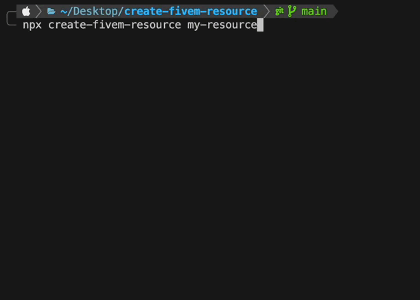

<h1 align="center">Create FiveM Resource</h1>

<div align="center">
This is a multiple boilerplate for getting started with TypeScript/Javascript/Lua game-scripts, and with Nui React/Vue in FiveM.
</div>

<div align="center">

[]()

</div>

## Quick Start

```sh
npx create-fivem-resource my-resource
```

This command will install and execute `create-fivem-resource`, an unofficial FiveM project scaffolding tool. You will be presented with prompts for several optional features such as TypeScript and Nui support :

> If you've previously installed `create-fivem-resource` globally via `npm install -g create-fivem-resource`, we recommend you uninstall the package using `npm uninstall -g create-fivem-resource` or `yarn global remove create-fivem-resource` to ensure that `npx` always uses the latest version.

_([npx](https://medium.com/@maybekatz/introducing-npx-an-npm-package-runner-55f7d4bd282b) comes with npm 5.2+ and higher, see [instructions for older npm versions](https://gist.github.com/JustinMartinDev/ea57d83b14ae76b0299d242d073b55a5))_

Then follow instruction of README.md in your resource

<p align='center'>

</p>
